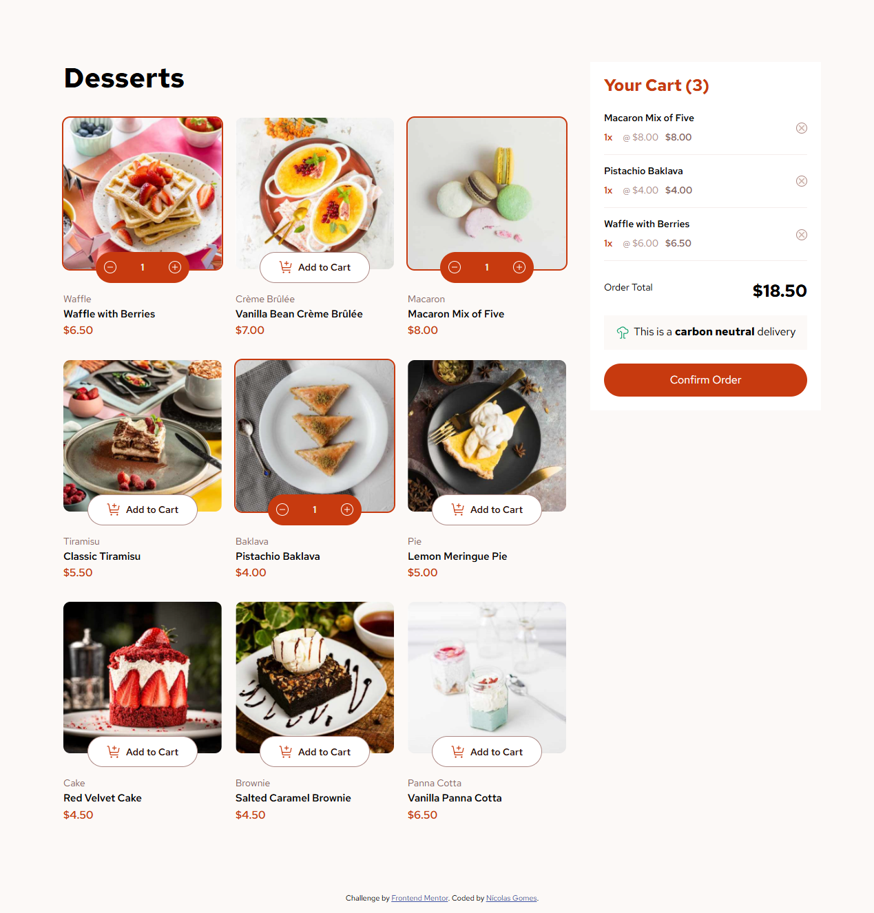
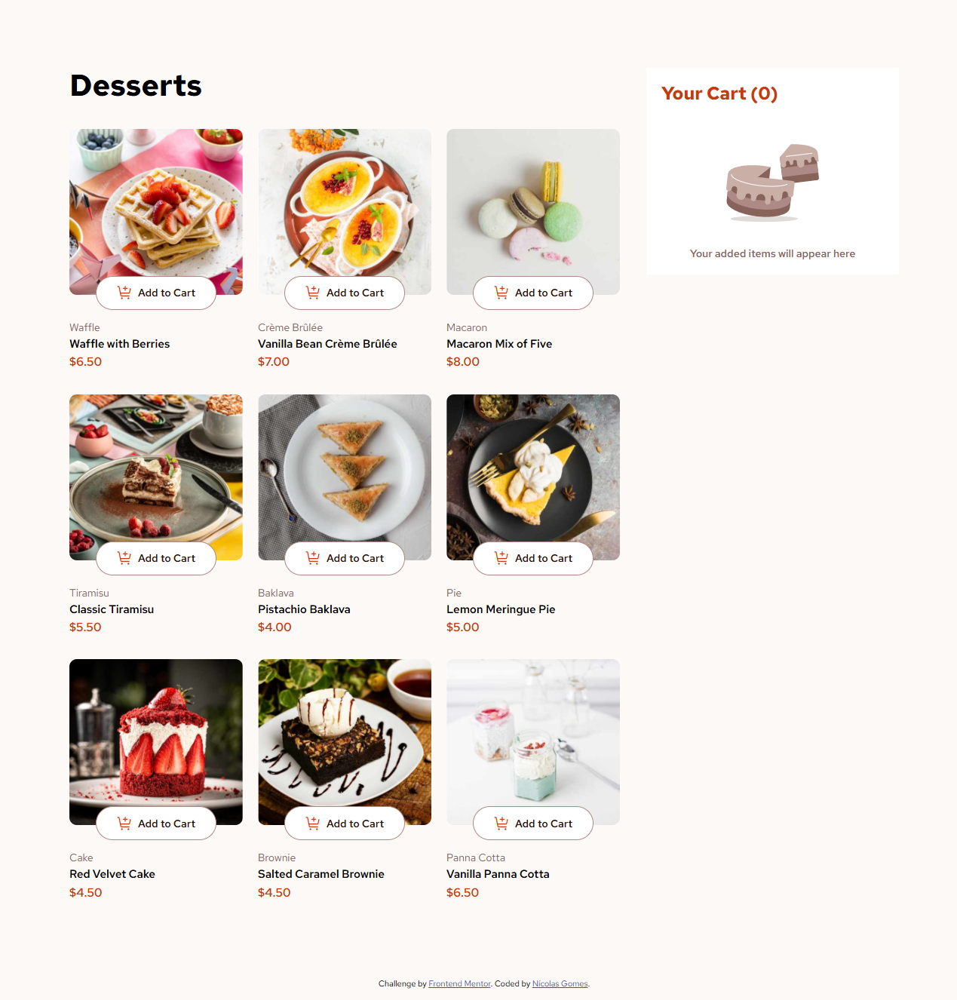
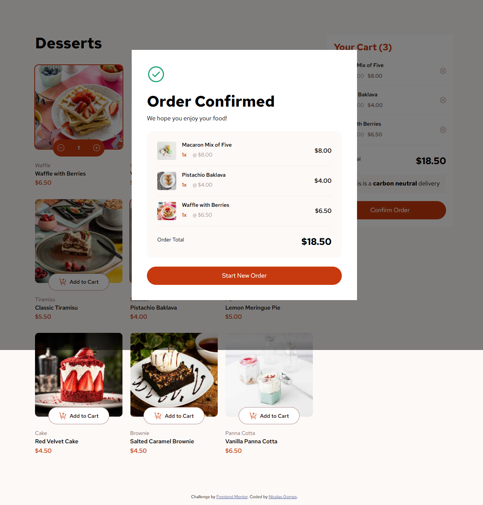
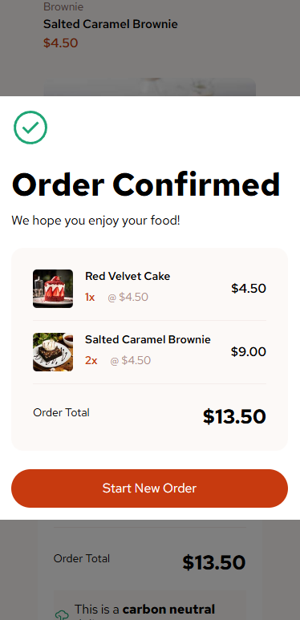
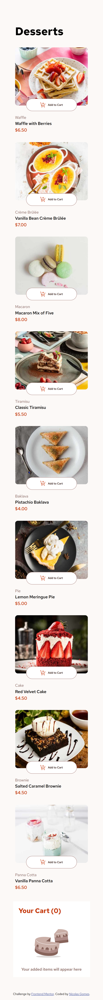
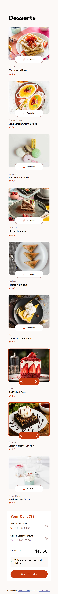

# Frontend Mentor - Product list with cart solution

This is a solution to the [Product list with cart challenge on Frontend Mentor](https://www.frontendmentor.io/challenges/product-list-with-cart-5MmqLVAp_d). Frontend Mentor challenges help you improve your coding skills by building realistic projects.

## Table of contents

- [Overview](#overview)
  - [The challenge](#the-challenge)
  - [Screenshot](#screenshot)
  - [Links](#links)
- [My process](#my-process)
  - [Built with](#built-with)
  - [Key Technical Features](#key-technical-features)
  - [AI Collaboration](#ai-collaboration)
- [Author](#author)

## Overview

### The challenge

Users should be able to:

- Add items to the cart and remove them
- Increase/decrease the number of items in the cart
- See an order confirmation modal when they click "Confirm Order"
- Reset their selections when they click "Start New Order"
- View the optimal layout for the interface depending on their device's screen size
- See hover and focus states for all interactive elements on the page

### Screenshots

<table>
  <tr>
    <td align="center">
       
      <b>Active States</b>
    </td>
    </tr>
    <tr>
    <td align="center">
       
      <b>Desktop Empty</b>
    </td> 
    </tr> 
    <tr>
    <td align="center">
       
      <b>Order Confirmation</b>
    </td>  
  </tr>
  <tr>  
    <td align="center">
       
      <b>Mobile Confirmation</b>
    </td>
    <td align="center">
       
      <b>Mobile Empty</b>
    </td>    
    <td align="center">
       
      <b>Mobile Selected</b>
    </td>
  </tr>
</table>

### Links

- Solution URL: [Add solution URL here](https://github.com/NicolasSG/product-list-with-cart-main)
- Live Site URL: [Add live site URL here](https://your-live-site-url.com)

## My process

### Built with

- Semantic HTML5 markup
- CSS custom properties
- Flexbox
- CSS Grid
- Vanilla JavaScript (ES6+)
- HTML <template> tags for dynamic DOM injection

### Key Technical Features

1. Dynamic Templating
   Instead of hardcoding the UI, this project utilizes multiple <template> tags to manage different states of the application:

card_template: Renders the product grid.

cart**template_empty / cart**template_full: Handles the logic for the empty vs. active shopping cart.

cart\_\_template_confirmation: Manages the final checkout modal.

2. Advanced CSS Layouts
   The project uses a responsive grid system that adapts from a 3-column layout on desktops to a single-column layout on mobile devices.

CSS
.cards {
display: grid;
grid-template-columns: repeat(3, 1fr);
gap: 33px 20px;
}

@media screen AND (max-width: 850px) {
.cards {
grid-template-columns: 1fr;
}
}

3. State-Driven UI
   The JavaScript logic manages a cart array. When the user interacts with the buttons, the script clears and re-renders specific DOM sections using the template fragments, ensuring the UI stays in sync with the data.

What I learned
State Syncing: I implemented a synchronization logic between the Product Grid and the Shopping Cart using Data-Attributes. This allowed the UI to toggle between 'Add to Cart' and 'Quantity Counter' states accurately when items were removed or updated from either side of the application."

Accessibility: Implemented .sr-only (Screen Reader Only) classes for live region announcements.

Interactive UI Components: Built a complex "Add to Cart" button that transforms into a quantity selector using absolute positioning and replaceWith() logic in JavaScript.

Modal Logic: Managed a global .modal\_\_overlay with a hidden class toggle to handle the order confirmation flow.

### AI Collaboration

🤖 AI Usage & Collaboration
During the development of this project, I used AI assistants (Gemini/ChatGPT) to act as a technical pair programmer. This collaboration was focused on solving specific CSS hurdles and improving the overall User Experience.

Tools Used
Gemini 1.5 Flash: Primary assistant for debugging, architectural discussions, and README documentation.

How I Used AI
Visual Debugging: I used AI to identify the "ghost" horizontal scroll issue. It helped me implement a global box-sizing: border-box reset and audit overflow points in my media queries.

Accessibility & Interactivity: We brainstormed ways to make the "Add to Cart" buttons easier to click on mobile. The AI suggested using Pseudo-elements (::before) to expand the clickable area (hitbox) without changing the visual design, following the 44px WCAG standard.

Advanced CSS Interaction: Since standard CSS cannot rotate or shadow the default OS cursor, the AI provided a breakdown of how to implement a Custom Cursor using a mix of CSS transform and a JavaScript mouse listener.

Key Takeaways
What worked well: The AI was excellent at explaining why certain CSS properties (like opacity) behave the way they do, which helped me avoid repetitive bugs.

What required human oversight: While the AI suggested the logic for the shopping cart counter, I had to carefully integrate it with my HTML <template> structure to ensure the DOM was being manipulated correctly without breaking the event listeners.

## Author

- Website - [Add your name here](https://www.your-site.com)
- Frontend Mentor - [@yourusername](https://www.frontendmentor.io/profile/yourusername)
- Twitter - [@yourusername](https://www.twitter.com/yourusername)
